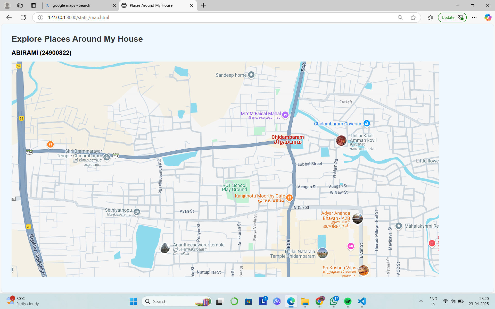

# Ex04 Places Around Me
# Date:11/04/2025
# AIM
To develop a website to display details about the places around my house.

# DESIGN STEPS
## STEP 1
Create a Django admin interface.

## STEP 2
Download your city map from Google.

## STEP 3
Using <map> tag name the map.

## STEP 4
Create clickable regions in the image using <area> tag.

## STEP 5
Write HTML programs for all the regions identified.

## STEP 6
Execute the programs and publish them.

# CODE
map.html
```
<!DOCTYPE html>
<html lang="en">
<head>
  <meta charset="UTF-8">
  <title>Places Around My House</title>
  <style>
    body {
      font-family: Arial, sans-serif;
      margin: 40px;
      background-color: #f0f8ff;
    }
    h1 {
      color: #333;
    }
    .place-info {
      margin-top: 20px;
    }
  </style>
</head>
<body>

  <h1>Explore Places Around My House</h1>
  <h2>ABIRAMI (24900822)</h2>


<map name="image-map">
    <area target="" alt="Shri Brammarayar Temple" title="Shri Brammarayar Temple" href="bramma.html" coords="" shape="rect">
    <area target="" alt="Sethiyathopu" title="Sethiyathopu" href="seth.html" coords="466,596,53" shape="circle">
    <area target="" alt="Anantheesawarar temple" title="Anantheesawarar temple" href="ananth.html" coords="583,681,835,772" shape="rect">
    <area target="" alt="Thillai Natraja Temple" title="Thillai Natraja Temple" href="thillai.html" coords="1207,773,997,706" shape="rect">
    <area target="" alt="Thillai Kaali Amman Kovil" title="Thillai Kaali Amman Kovil" href="amman.html" coords="NaN" shape="circle">
</map>
</body>
</html>
```
seth.html
```
<!DOCTYPE html>
<html lang="en">
<head>
  <meta charset="UTF-8">
  <title>Sethiyathopu</title>
  <style>
    body {
      background-color: #e0f7f7;
      color: #004d4d;
      font-family: 'Verdana', sans-serif;
      padding: 2rem;
    }
    a { color: #007070; text-decoration: none; }
  </style>
</head>
<body>
  <h1>Sethiyathopu</h1>
  <p><strong>Overview:</strong> Sethiyathopu is a charming rural settlement known for its agriculture, community bonds, and serene lifestyle.</p>
  <p><strong>Local Life:</strong> Most people are engaged in farming—especially rice, sugarcane, and coconut cultivation.</p>
  <p><strong>Festivals:</strong> Pongal and Tamil New Year are celebrated with kolams, bullock cart races, and cultural performances.</p>
  <p><strong>Fun Fact:</strong> The name "Sethiyathopu" literally means "the garden of nobles."</p>
</body>
</html>

```
amman.html
```
<!DOCTYPE html>
<html lang="en">
<head>
  <meta charset="UTF-8">
  <title>Thillai Kaali Amman Kovil</title>
  <style>
    body {
      background-color: #ffebee;
      color: #b71c1c;
      font-family: 'Tahoma', sans-serif;
      padding: 2rem;
    }
    a { color: #c62828; text-decoration: none; }
  </style>
</head>
<body>
  <h1>Thillai Kaali Amman Kovil</h1>
  <p><strong>Goddess:</strong> Kaali, the fierce mother goddess who defeats evil and protects the righteous.</p>
  <p><strong>Tradition:</strong> The temple was constructed to honor Kaali’s divine presence after her legendary dance-off with Shiva.</p>
  <p><strong>Highlights:</strong> Known for powerful rituals and fiery festivals like Aadi Thiruvizha where devotees walk on fire pits.</p>
  <p><strong>Fun Fact:</strong> The temple is believed to be located on an energy node according to ancient Siddha texts.</p>
</body>
</html>

```
ananth.html
```
<!DOCTYPE html>
<html lang="en">
<head>
  <meta charset="UTF-8">
  <title>Anantheesawarar Temple</title>
  <style>
    body {
      background-color: #f3e5f5;
      color: #4a148c;
      font-family: 'Georgia', serif;
      padding: 2rem;
    }
    a { color: #6a1b9a; text-decoration: none; }
  </style>
</head>
<body>
  <h1>Anantheesawarar Temple</h1>
  <p><strong>Deity:</strong> Lord Shiva as Anantheesawarar, the timeless one.</p>
  <p><strong>History:</strong> A temple of great spiritual power, it is said to have been sanctified by ancient saints and Siddhars.</p>
  <p><strong>Architecture:</strong> Marvel at the stone pillars engraved with mythological scenes and the inner sanctum lit only by traditional lamps.</p>
  <p><strong>Festivals:</strong> Maha Shivaratri is observed with all-night chanting and abhishekams (holy bathing rituals).</p>
  
</body>
</html>

```
bramma.html
```
<!DOCTYPE html>
<html lang="en">
<head>
  <meta charset="UTF-8">
  <title>Shri Brammarayar Temple</title>
  <style>
    body {
      background-color: #fff8dc;
      color: #5c3d00;
      font-family: 'Segoe UI', sans-serif;
      padding: 2rem;
    }
    a { color: #a0522d; text-decoration: none; }
  </style>
</head>
<body>
  <h1>Shri Brammarayar Temple</h1>
  <p><strong>History:</strong> This temple dates back several centuries and was built during the Chola dynasty's reign. It's dedicated to Lord Brammarayar, a guardian deity believed to protect the land.</p>
  <p><strong>Architecture:</strong> Featuring traditional Tamil stone carvings and a tiered gopuram (temple tower), the temple showcases the intricate craft of early South Indian artisans.</p>
  <p><strong>Festivals:</strong> Annual festivals like Thai Poosam and Panguni Uthiram are celebrated with chariot processions and rituals.</p>
  <p><strong>Fun Fact:</strong> Locals believe the temple well never dries, even during the harshest summers!</p>
  
</body>
</html>

```
thillai.html
```
<!DOCTYPE html>
<html lang="en">
<head>
  <meta charset="UTF-8">
  <title>Thillai Natraja Temple</title>
  <style>
    body {
      background-color: #e3f2fd;
      color: #0d47a1;
      font-family: 'Trebuchet MS', sans-serif;
      padding: 2rem;
    }
    a { color: #1565c0; text-decoration: none; }
  </style>
</head>
<body>
  <h1>Thillai Natraja Temple</h1>
  <p><strong>Significance:</strong> This is one of the five Pancha Bhoota Sthalams, representing the element 'space' (Akasha).</p>
  <p><strong>Deity:</strong> Lord Nataraja, the cosmic dancer form of Shiva.</p>
  <p><strong>Architectural Wonder:</strong> The temple has 9-tiered gopurams, a golden roof over the sanctum, and inscriptions from Chola and Pallava kings.</p>
  <p><strong>Festival Highlight:</strong> Arudra Darshan is the most celebrated event, symbolizing cosmic dance and creation.</p>
 
</body>
</html>

```
# OUTPUT




# RESULT
The program for implementing image maps using HTML is executed successfully.
